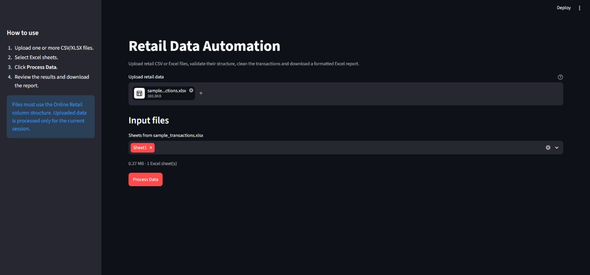
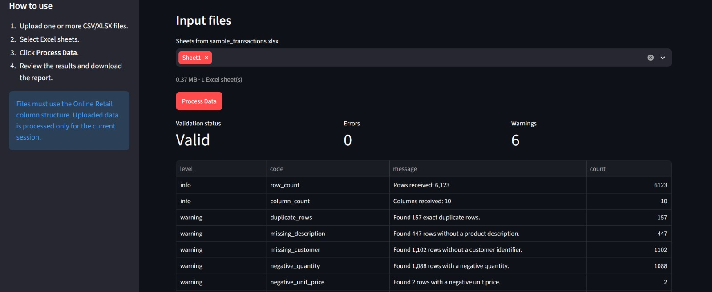
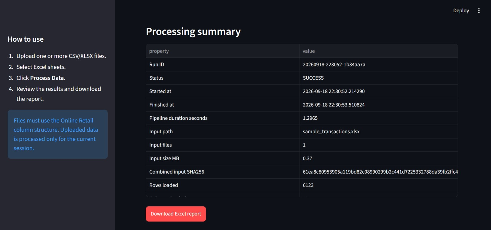
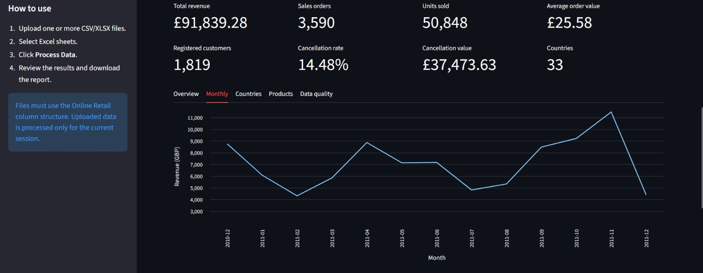
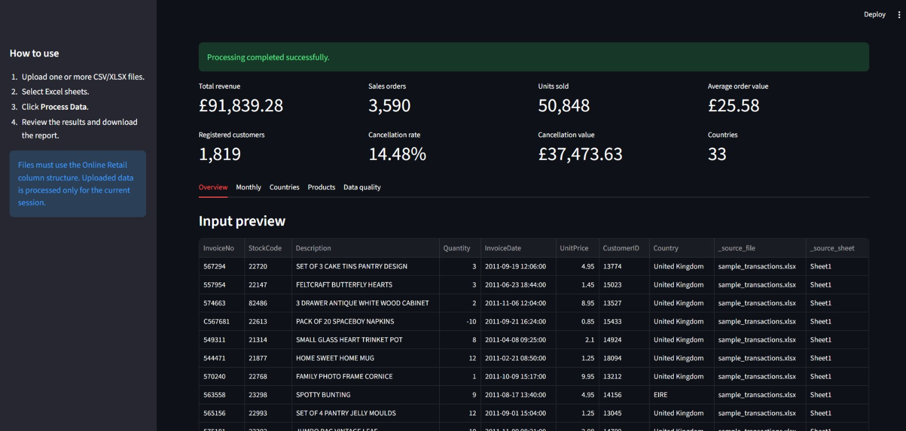
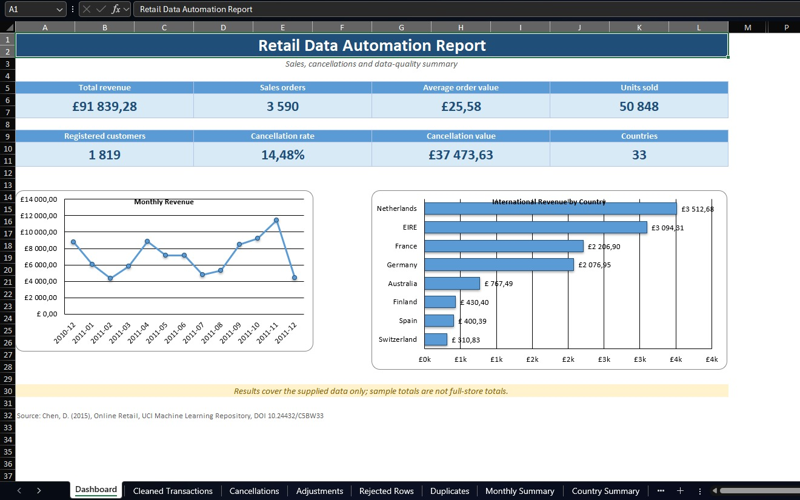

# Retail Data Automation

Convert retail CSV/XLSX exports into an auditable Excel analytics report.
Run from the command line or upload files through Streamlit.

## Features

- Load CSV/XLSX, select Excel sheets, merge matching files and process folders.
- Validate required columns and flag data-quality problems.
- Separate sales, cancellations, adjustments, rejected records and duplicates.
- Calculate 14 KPIs and monthly, country and product summaries.
- Export a dashboard, charts, Excel tables and conditional formatting.
- Preserve source file/sheet/row metadata and input checksums.

## Installation and usage

The author's recorded environment is Python 3.14.5 on Windows. Pinned dependency
versions come from that environment; fresh installation still needs verification
before release.

```powershell
git clone https://github.com/AyaulymKibasheva/retail-data-automation.git
cd retail-data-automation
python -m venv .venv
.venv\Scripts\Activate.ps1
python -m pip install -r requirements.txt
python -m pytest -q
python main.py
```

The default input is `data/sample/sample_transactions.xlsx`; the default output
is `output/retail_automation_report.xlsx`.

```powershell
python main.py "data/raw/online_retail.xlsx" -o "output/retail_automation_report.xlsx"
python main.py "data/batch_sample" -o "output/retail_automation_report.xlsx"
python main.py --help
python -m streamlit run app.py
```

Create the batch folder and populate it with compatible inputs before using it.
Keep reports outside the input folder. Existing output files are replaced; close
Excel before rerunning. Source and output must not be the same file.

In Streamlit, upload files, select sheets, click **Process Data**, then download
the report. Files are temporarily stored on the computer hosting Streamlit.
Public deployment with sensitive data requires additional security controls.

## Input and cleaning rules

Required columns: `InvoiceNo`, `StockCode`, `Description`, `Quantity`,
`InvoiceDate`, `UnitPrice`, `CustomerID`, `Country`. CSV defaults to comma
separation. Files/sheets must have matching column sets.

Processing order:

1. Normalize types/text and remove repeated business rows after normalization.
2. Reject missing/invalid invoice, stock code, date, quantity, price or country,
   and zero quantities.
3. Classify remaining invoice numbers starting with `C` as cancellations.
4. Classify remaining negative quantities, non-positive prices and invoice
   numbers starting with `A` as adjustments.
5. Keep remaining rows as sales, flagging missing descriptions/customer IDs.

Removed duplicates are retained separately. All categories must reconcile to
the input row count. Preserve identifiers as text upstream: already-lost leading
zeros cannot be reconstructed.

## Metrics and limitations

- Revenue is sale quantity × price, rounded per line, not profit or net revenue.
- Average order value = revenue / distinct sales invoice numbers.
- Cancellation rate = distinct cancellation invoices / (distinct sales invoices
  + distinct cancellation invoices). It is not a matched-order return rate.
- Average product unit price is an unweighted mean of line prices.
- Domestic means United Kingdom; GBP is assumed.
- The sample includes selected edge cases, not a representative store sample.
  Partial invoices mean sample AOV must not be treated as a business estimate.
- Repeated identical lines are removed by policy; in another business they may
  represent legitimate purchases.
- Processing is memory-based. Large Excel exports may be slow and are subject
  to worksheet row limits. Pipeline timings exclude final Excel export.

## Output

Dashboard, Cleaned Transactions, Cancellations, Adjustments, Rejected Rows,
Duplicates, Monthly Summary, Country Summary, Product Summary, Processing Log,
Validation Issues.

## Recorded full-data run

The author recorded these results locally before this review; they are not
performance guarantees:

| Metric | Result |
| --- | ---: |
| Input rows | 541,909 |
| Sales rows | 524,877 |
| Cancellations | 9,251 |
| Adjustments | 2,513 |
| Rejected rows | 0 |
| Removed duplicates | 5,268 |
| Sales revenue (GBP) | 10,631,048.74 |

Recorded pipeline duration: 30.94 seconds, excluding Excel export. Report size:
68.81 MiB. Five source-to-output records were manually checked.

## Architecture and tests

`loader` / `batch_loader` → `validator` → `cleaner` → `transformer` → `analytics`
→ `excel_exporter`. `main.py` and `app.py` provide the entry points. Inspection,
sample creation and intermediate-export modules remain development utilities.

Run `python -m pytest -q`. GitHub Actions is configured; check its actual run
status after pushing. A workflow file alone does not establish remote success.

## Data and release checklist

The sample comes from **Online Retail**, not Online Retail II. Source attribution:
Chen, D. (2015), UCI Machine Learning Repository, DOI
[10.24432/C5BW33](https://doi.org/10.24432/C5BW33).
Download the full file separately to `data/raw/online_retail.xlsx`.

Raw data, generated reports, environments and editor settings are ignored by Git.
Do not distribute an archive of the entire working folder.

## Screenshots

### Upload and sheet selection



### Data quality validation



### Application dashboard



### Monthly analytics



### Country analytics



### Excel report

